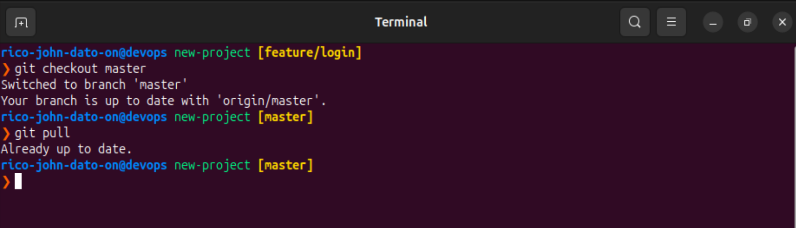
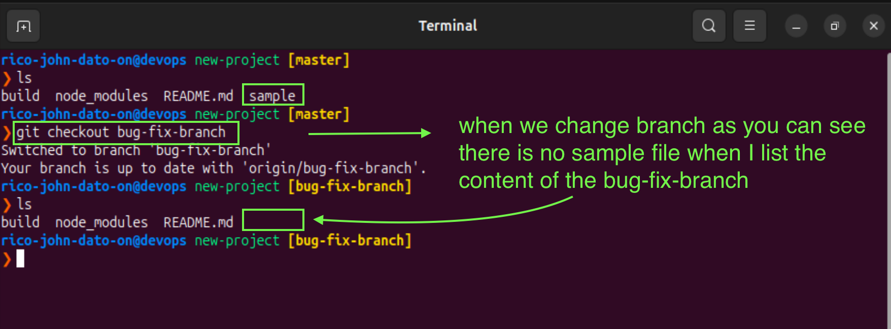
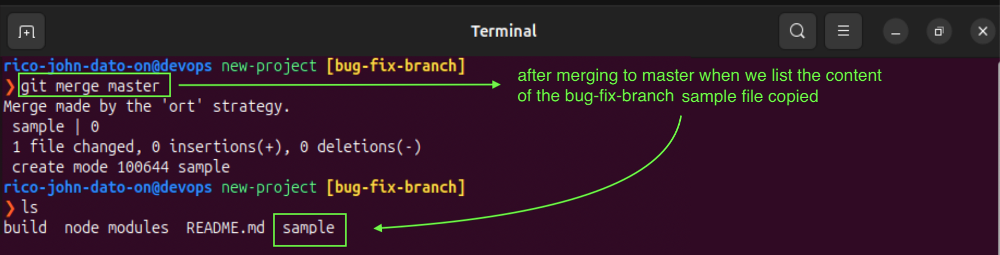
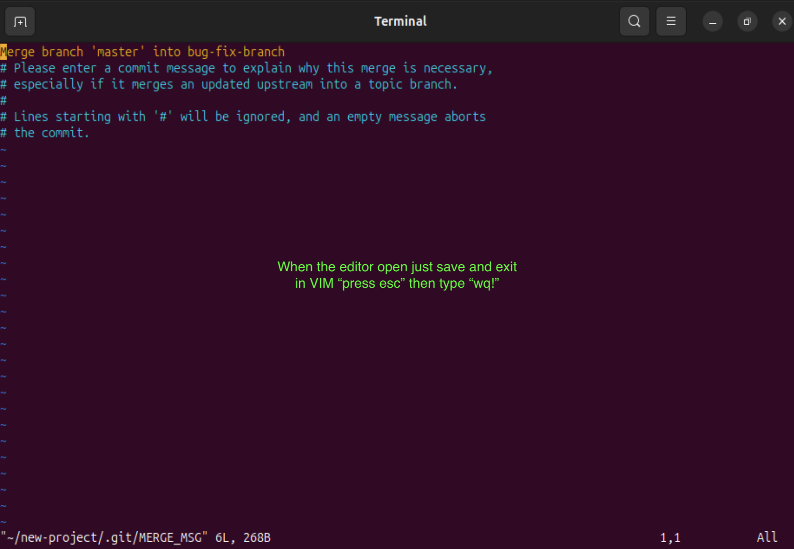

# Git Merge 🧩

## 📝 Overview

The `git merge` command allows you to combine changes from one branch into another. This is typically used in two main cases:

1. **Merging `master` (or `main`) into your feature/bug-fix branch** to get the latest updates.
2. **Merging your feature/bug-fix branch back into `master`** once your work is complete.

---

## 🔀 Example Workflow

### Scenario: Merging Master into Your Bug Fix Branch

Let’s say your **bug-fix branch** has been open for several days and other developers have merged many changes into the `master` branch.

You need those latest changes to test your bug fix properly.

---

### 🧱 Step-by-Step Process

1. Update your local master branch:

```bash
git checkout master
git pull
```



2. Switch to your bug-fix branch:

```bash
git checkout bug-fix-branch
```



3. Merge master into your bug-fix branch and push:

```bash
git merge master
```



4. Note! when you git merge it will open your editor just save and quit



## ✅ Git Merge in UI vs CLI

- Git UI (e.g., GitLab, GitHub):
  - You can create a merge request or pull request.
  - Someone can review, approve, and merge your code via the interface.
- Git CLI (Command Line):
  - Run git merge to combine branches manually.
  - Run git push to push the result to the remote repository.

## 🔧 Common Merge Scenarios

| Scenario                                    | Merge Direction             | Command Example            |
| ------------------------------------------- | --------------------------- | -------------------------- |
| Keep your bug-fix/feature branch up to date | `master` → `bug-fix-branch` | `git merge master`         |
| Finalize and integrate your work            | `bug-fix-branch` → `master` | `git merge bug-fix-branch` |

## 🧭 Tips & Best Practices

- Always pull the latest changes in master before merging it into your feature/bug-fix branch.
- Resolve any merge conflicts during the process.\
- Use clear commit messages when merging.
- After merging into master, delete the feature branch if it’s no longer needed.

## 📂 Final Result

- After the merge, your master branch will contain:
  - All recent updates from other branches.
  - Your tested and approved bug fix or feature.
  - A clean history with merge commits documenting the integration.
